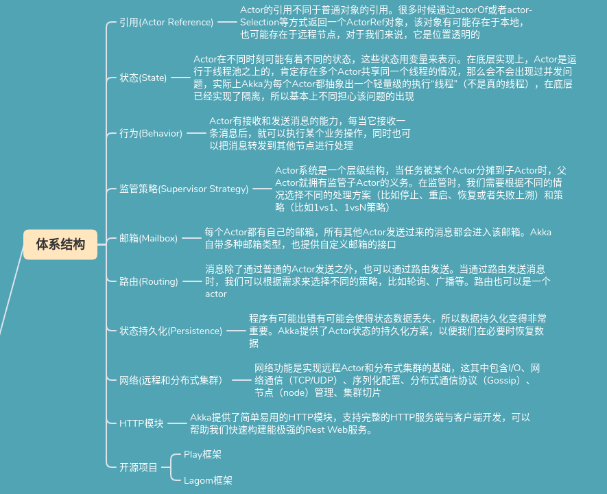
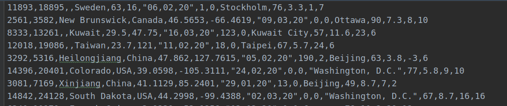
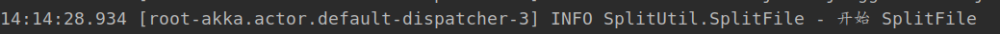
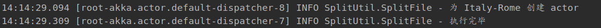

# Akka实践（1）: 如何优雅使用多线程进行文件数据拆分

前言：之前做生信的时候有拆分数据的需求，通过线程池进行拆分会导致数据顺序被打乱，这个问题如心中块垒，在看并发书籍的时候了解到了akka，我的第一反应就是可以优雅的解决之前拆数据的问题，于是就花了些时间学习了一下akka，这里就介绍如何通过akka进行高并发文件拆分，也算是了却一桩心事。

## 1. akka简介

[官网链接](https://akka.io/)

Akka是一个开发库和运行环境，可以用于构建高并发、分布式、可容错、事件驱动的基于JVM的应用，使构建高并发的分布式应用更加容易。spark、flink底层的分布式计算和通信实现都是akka，之前做生信是使用的`workflow`工具`cromwell`底层也是akka。

akka将并发功能抽象出来通过actor执行，一个actor通过定义执行一类事物，同时自行管理状态，避免了使用锁或是原子性造成性能变差，同时一个actor处理事务是线性的，也就是说按顺序执行，这些特性可以让分布式高并发项目写起来更加逻辑更加清晰。


### 1. 1体系结构




## 2. 代码实现

简单的逻辑就是：

+ 首先确定拆分规则
+ 通过编写一个managerActor进行任务的分发，这个actor会记录创建过的底层actor和创建的bufferedwriter
+ 创建执行actor，用于将数据写入对应文件
+ 我们获取每一条数据，通过规则提取出区分信息（key），将区分信息和数据tell managerActor， manager 通过 key获取到执行actor和对应的bufferedwriter，再tell 执行actor
+ 执行actor获取数据和writer后将数据写入writer

### 2.1 任务分发actor

+ 通过map记录key和actor的对应关系
+ 因为状态在actor内部，因此不需要使用`ConcurrentHashMap`

```java
Map<String, ActorRef<SplitWriter.Command>> actorMap = new HashMap<>();
Map<String, BufferedWriter> bufferMap = new HashMap<>();
```

+ 分发任务主体逻辑
+ 有actor就执行，没有就创建并存储并执行

```java
private Behavior<Command> onPost2Actor(Fileline info) throws IOException {
    if (actorMap.containsKey(info.filename)) {
        ActorRef<SplitWriter.Command> actor = actorMap.get(info.filename);
        actor.tell(new SplitWriter.Write2File(info.line, bufferMap.get(info.filename)));
    }
    else {
        getContext().getLog().info("为 {} 创建 actor", info.filename);
        BufferedWriter bf = Files.newBufferedWriter(Path.of(info.filepath));
        bufferMap.put(info.filename, bf);
        ActorRef<SplitWriter.Command> actor = getContext().spawn(SplitWriter.create(0), info.filename);
        actorMap.put(info.filename, actor);
        actor.tell(new SplitWriter.Write2File(info.line, bf));
    }
    return this;
}
```

+ 结束后关闭所有`bufferedWriter`

```
private Behavior<Command> onPostStop() {
    bufferMap.forEach((k, v) -> {
        try {
            v.close();
        } catch (IOException e) {
            e.printStackTrace();
        }
    });
    getContext().getLog().info("执行完毕");
    return Behaviors.stopped();
}
```

### 2.2 执行actor

+ 将分发过来的任务执行
+ 这里设置一个counter状态，用于记录，写入50条后进行flush操作

```java
private Behavior<Command> onWrite2File(Write2File info) throws IOException {
    info.bw.write(info.line);
    if (counter++ >= 50) {
        info.bw.flush();
        counter=0;
    }
    return this;
}
```

### 2.3  启动类

+ 通过ActorSystem创建分发任务 `actor`

```
ActorSystem<SplitFile.Command> system = ActorSystem.create(SplitFile.create(), "root");
```

+ 使用nio获取文件数据流
+ 每行数据提取处filename，和文件名，文件名用来生成`BufferedWriter`，这里的filename就是我上面说的key，用来区分actor，以及给actor命名

```java
        Files.lines(Path.of("test_data.csv"))
                .forEach(line -> {
                    String[] arrStr = line.split(",");
                    String filename = transName(arrStr[3] + "_" +arrStr[11]);
                    String filePath = "./tmp/"+arrStr[3] + "_" +arrStr[11]+".csv";
                    system.tell(new SplitFile.Fileline(filename, line+"\n", filePath));
                });
```

+ 由于actor命名中不能出现一些字符如：`$`, `\`,空格等，需要处理一下filename，简单粗暴把特殊字符都换成`-`，反正也是用作key

```java
private static String transName (String name) {
    StringBuilder ret = new StringBuilder();
    for (int i = 0; i < name.length(); i++) {
        char it = name.charAt(i);
        if (( it>='a' && it <='z')||(it>='A' && it <='Z')) ret.append(it);
        else ret.append('-');
    }
    return ret.toString();
}
```

+ 并发通病不能直接结束main线程，不然任务跑不完

```java
Thread.sleep(200);
system.terminate();
```

## 3. 测试

### 3.1 测试数据

kaggle随便找了个数据，文件大小1.3M，通过地区进行拆分文件



### 3.2 打乱顺序

```java
List<String> lines = Files.readAllLines(Path.of("temperature_dataframe_editUS.csv"));
Collections.shuffle(lines);
BufferedWriter bw = Files.newBufferedWriter(Path.of("test_data.csv"));
for (String s : lines) {
    bw.write(s);
    bw.newLine();
}
bw.close();
```

### 3.3 测试

+ 开始



+ 结束



从开始到最后一个文件生成大约 `180ms`左右

### 3.4 总结

对akka不是特别熟，如果有什么问题还请请批评指正。我也不知道1.3M文件180ms是快还是慢，这里就不求证了。


## 4. 源码